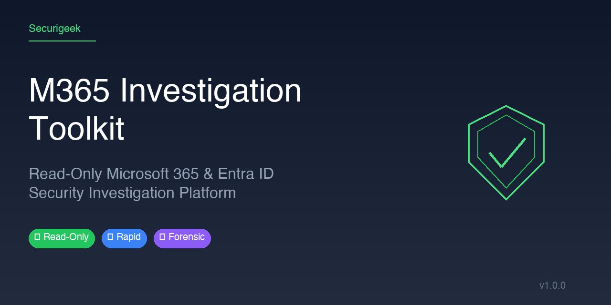

# M365 Investigation Toolkit

> **Read-Only Microsoft 365 & Entra ID Security Investigation Platform**

[](https://github.com/PowerShell/PowerShell)
[](./tests)
[](./LICENSE)
[]()

A comprehensive, **read-only** security investigation toolkit for Microsoft 365 and Entra ID environments. Designed for security analysts, incident responders, and MSSPs to rapidly assess compromise indicators without making any changes to the tenant.

---

## Overview

### What This Tool Does

The M365 Investigation Toolkit performs **delegated, read-only security assessments** of Microsoft 365 and Entra ID tenants. It collects forensic evidence across Exchange Online, Entra ID, and the Unified Audit Log to identify compromise indicators, suspicious configurations, and attack patterns.

**Key Principles:**
- 🔒 **Read-Only**: Zero remediation actions - pure evidence collection
- 🔐 **Delegated Auth**: Browser-based Microsoft 365 admin sign-in (no secrets stored)
- 📊 **Forensic Output**: Structured JSON artifacts + analyst-readable reports
- ⚡ **Single Command**: One launcher, one guided run, comprehensive results

### Who It's For

| Role | Use Case |
|------|----------|
| **Security Analysts** | Rapid compromise assessment during incidents |
| **Incident Responders** | Evidence collection for breach investigations |
| **MSSPs** | Standardized client security assessments |
| **IT Administrators** | Proactive security posture validation |
| **Forensic Teams** | Structured evidence export for deeper analysis |

### Key Features

- ✅ **Zero-Config Deployment**: No app registration or certificates required
- ✅ **Multi-Module Collection**: 14+ investigation modules covering Exchange, Identity, and Audit
- ✅ **Smart Pivoting**: Optional sender/domain/recipient/subject filters for targeted investigations
- ✅ **Confidence-Aware Verdicts**: Risk scoring with explicit collection gaps and limitations
- ✅ **Branded Reporting**: Executive presentations with custom branding (Securigeek, Cydenti)
- ✅ **Cross-Platform**: Windows and macOS support with PowerShell 7.5+

---

## What It Investigates

### Exchange Online Checks

| Module | Description | Data Collected |
|--------|-------------|----------------|
| **Mailbox Forwarding** | Detects unauthorized email forwarding rules | SMTP forwarding addresses, forwarding types, hidden rules |
| **Inbox Rules** | Identifies suspicious mail processing rules | Rule conditions, actions, sender-based deletions |
| **Transport Rules** | Reviews organization-wide mail flow rules | Rule predicates, actions, priority ordering |
| **Connectors** | Examines inbound/outbound mail connectors | Connector configurations, TLS settings, smart hosts |
| **Message Trace** | Tracks email delivery when pivots provided | Delivery status, timestamps, routing details |
| **Quarantine** | Searches quarantined messages by pivot | Quarantine reason, release status, threat types |

### Identity & Access Checks

| Module | Description | Data Collected |
|--------|-------------|----------------|
| **Risky Sign-Ins** | Detects high/medium risk authentication events | Risk levels, risk types, detection timing |
| **Interactive Sign-Ins** | User-initiated authentication sessions | IP addresses, locations, MFA results, client apps |
| **Non-Interactive Sign-Ins** | Token-based/service authentication | App tokens, resource access, conditional access |
| **Service Principal Sign-Ins** | App-to-app authentication activity | SPN logins, certificate auth, client credentials |
| **Directory Audit Log** | Entra ID administrative changes | User/Group/Policy modifications, role changes |
| **Consent Grants** | OAuth application permissions | Delegated vs app-only grants, high-risk scopes |
| **Role Assignments** | Privileged role activity | PIM activations, permanent assignments, eligible roles |

### Threat Detections

The toolkit includes specialized detectors for modern attack patterns:

| Detection | Attack Vector | Indicators |
|-----------|---------------|------------|
| **OAuth Consent Abuse** | Illicit app permissions | Suspicious app registrations, overprivileged grants |
| **Device Code Phishing** | Token harvesting | Anomalous device code flows, unusual client patterns |
| **Dormant Account MFA Takeover** | Stale account compromise | Inactive accounts with recent MFA changes |
| **BEC Indicators** | Business Email Compromise | Inbox rules matching BEC patterns, forwarding to external |
| **Password Spray** | Credential stuffing | Multiple failed logins from same IP, impossible travel |
| **Audit Evasion** | Defense evasion | Audit log tampering attempts, suspicious admin activity |
| **Service Principal Backdoors** | Persistent access | New SPNs with suspicious permissions |
| **Federated Backdoors** | Identity provider abuse | SAML/WS-Fed configuration changes |
| **Data Exfiltration** | Data theft | Large mailbox exports, suspicious sharing |

---

## Installation

### Prerequisites

- **PowerShell** 7.5 or later ([Download](https://github.com/PowerShell/PowerShell/releases))
- **Windows** 10/11/Server 2019+ or **macOS** 11+
- **Microsoft 365 admin account** with permissions to grant read-only scopes
- **Internet access** for Microsoft Graph and module installation

### Quick Install

```bash
# Clone or download the repository
git clone https://github.com/yourorg/M365-Investigation-Toolkit.git
cd M365-Investigation-Toolkit

# Verify prerequisites
pwsh -Command "Get-Host"
```

### Required PowerShell Modules

The following modules are **automatically installed** on first run (after confirmation):

| Module | Minimum Version | Purpose |
|--------|-----------------|---------|
| `Microsoft.Graph.Authentication` | 2.0 | Graph API authentication |
| `Microsoft.Graph.Users` | 2.0 | User data collection |
| `Microsoft.Graph.Mail` | 2.0 | Mailbox operations |
| `Microsoft.Graph.Identity.SignIns` | 2.0 | Sign-in and risk data |
| `Microsoft.Graph.Applications` | 2.0 | App registration data |
| `ExchangeOnlineManagement` | 3.0 | Exchange Online commands |

### Verification

```bash
# Run the prerequisite check
pwsh -File ./Run-Investigation-Collector.ps1 -SkipPrompt
# Type 'test' at case name prompt to validate setup
```

---

## Usage Guide

### Basic Usage

Run with interactive prompts (recommended for first use):

```bash
pwsh -File ./Run-Investigation-Collector.ps1
```

The script will:
1. Prompt for case name and lookback period
2. Check and install required modules
3. Open browser for Microsoft 365 admin sign-in
4. Collect evidence across all available modules
5. Generate verdict and output files

### Advanced Usage

```powershell
# Full parameter example with pivots
pwsh -File ./Run-Investigation-Collector.ps1 `
  -CaseName "suspicious-email-investigation" `
  -DaysBack 7 `
  -Sender "attacker@malicious.com" `
  -Domain "malicious.com" `
  -UserPrincipalName "victim@contoso.com" `
  -SubjectContains "urgent invoice" `
  -TenantId "00000000-0000-0000-0000-000000000000" `
  -TenantDomain "contoso.onmicrosoft.com"
```

### Parameter Reference

| Parameter | Description | Default |
|-----------|-------------|---------|
| `-CaseName` | Investigation case identifier | Auto-generated timestamp |
| `-DaysBack` | Lookback period in days | 14 |
| `-Sender` | Email sender to pivot on | (optional) |
| `-Domain` | Domain to pivot on | (optional) |
| `-UserPrincipalName` | Recipient mailbox to focus on | (optional) |
| `-SubjectContains` | Subject text fragment to match | (optional) |
| `-TenantId` | Target tenant for validation | (auto-detected) |
| `-TenantDomain` | Exchange domain validation | (auto-detected) |
| `-SkipPrompt` | Run non-interactively | Prompts enabled |

### Example Scenarios

#### Scenario 1: Compromise Baseline Check

Quick tenant health check with no specific pivots:

```bash
# Using the convenience alias
pwsh -File ./Run-Compromise-Baseline.ps1
```

#### Scenario 2: Suspicious Email Investigation

Investigate a reported phishing email:

```bash
pwsh -File ./Run-Investigation-Collector.ps1 `
  -CaseName "phishing-report-2024-001" `
  -DaysBack 3 `
  -Sender "suspicious@external.com" `
  -SubjectContains "password reset"
```

#### Scenario 3: User-Centric Investigation

Deep dive on a potentially compromised user:

```bash
pwsh -File ./Run-Investigation-Collector.ps1 `
  -CaseName "user-alice-compromise-check" `
  -DaysBack 30 `
  -UserPrincipalName "alice@contoso.com"
```

#### Scenario 4: Automated/Scheduled Run

Non-interactive execution for automation:

```bash
pwsh -File ./Run-Investigation-Collector.ps1 `
  -CaseName "daily-baseline" `
  -DaysBack 1 `
  -SkipPrompt
```

---

## Output Structure

Each investigation creates a timestamped case folder:

```
output/incidents/
└── {case-slug}-{timestamp}/
    ├── manifest.json                    # Investigation metadata
    ├── preflight-capabilities.json      # Auth and API status
    ├── api-catalog.json                 # Available API modules
    ├── collection-status.json           # Module success/failure status
    ├── findings-summary.json            # Normalized findings
    ├── findings-summary.md              # Human-readable report
    ├── verdict.json                     # Risk verdict and score
    ├── detections.json                  # Threat detection results
    ├── confidence-assessment.json       # Collection gaps and limits
    ├── raw/                             # Raw API responses
    │   ├── mailbox-forwarding.json
    │   ├── inbox-rules.json
    │   ├── risky-signins.json
    │   └── ...
    └── normalized/                      # Processed evidence
        ├── mailbox-forwarding.csv
        ├── signins-analyzed.json
        └── ...
```

### Key Output Files

| File | Purpose |
|------|---------|
| `verdict.json` | Overall risk assessment (Low/Medium/High) |
| `findings-summary.md` | Analyst-friendly Markdown report |
| `detections.json` | Structured threat detection findings |
| `collection-status.json` | What ran, what skipped, and why |

### Status Meanings

| Status | Meaning |
|--------|---------|
| `Not observed` | Evidence source ran, behavior not detected |
| `Skipped` | Module intentionally skipped (e.g., missing pivots) |
| `Unavailable` | API, role, or license not available |
| `Failed` | Collection attempted but encountered error |

---

## Branded Presentations

Generate executive-ready PowerPoint presentations with company branding:

### Available Brands

| Brand | Description |
|-------|-------------|
| **Securigeek** | French cybersecurity company (France Cybersecurity Label, ANSSI) |
| **Cydenti** | Identity-first security provider |

### Generate Presentation

```bash
# Interactive brand selection
pwsh -File ./generate-branded-presentation.ps1 `
  -InvestigationPath "./output/incidents/case-001-20240306-120000"

# Skip brand prompt (default: Securigeek)
pwsh -File ./generate-branded-presentation.ps1 `
  -InvestigationPath "./output/incidents/case-001-20240306-120000" `
  -SkipPrompt
```

### Presentation Contents

Generated presentations include:
- **Title Slide**: Branded header with severity badge
- **Executive Summary**: Risk score, metrics, key findings
- **Contact Slide**: Company details and credentials

### Custom Branding

Add your own brand configuration in `scripts/lib/branding.ps1`:

```powershell
"YourBrand" = @{
    Name = "YourBrand"
    FullName = "Your Company Name"
    Tagline = "Your tagline here"
    PrimaryColor = "#1e3a5f"
    AccentColor = "#00d4aa"
    # ... see branding.ps1 for full schema
}
```

---

## Testing

Run the comprehensive PowerShell test suite:

```bash
# Full test suite
pwsh -NoLogo -NoProfile -Command "Invoke-Pester tests/powershell -Output Detailed"

# Specific test category
pwsh -NoLogo -NoProfile -Command "Invoke-Pester tests/powershell/Detection.Tests.ps1 -Output Detailed"

# Syntax validation
pwsh -NoLogo -NoProfile -Command '
  $files = @(
    "scripts/lib/unified-audit.ps1",
    "scripts/collectors/Get-TenantAuditCoverage.ps1",
    "scripts/Invoke-InvestigationCollector.ps1"
  );
  $errors = @();
  foreach ($file in $files) {
    $null = [System.Management.Automation.PSParser]::Tokenize(
      (Get-Content -Raw $file), [ref]$errors
    )
  };
  if ($errors.Count -eq 0) { "PARSE_OK" } else { $errors }
'
```

### Test Coverage

| Test File | Coverage |
|-----------|----------|
| `Auth.Tests.ps1` | Authentication flows and token handling |
| `Collector.Tests.ps1` | Evidence collection modules |
| `Detection.Tests.ps1` | Threat detection logic |
| `Prereqs.Tests.ps1` | Prerequisites validation |
| `Reporting.Tests.ps1` | Output generation and formatting |
| `UnifiedAuditCollector.Tests.ps1` | UAL collection edge cases |

---

## Architecture

### High-Level Flow

```
┌─────────────────────────────────────────────────────────────────┐
│                    INVESTIGATION FLOW                            │
├─────────────────────────────────────────────────────────────────┤
│                                                                  │
│  ┌──────────┐   ┌──────────┐   ┌──────────┐   ┌──────────┐     │
│  │ PREFLIGHT│ → │ COLLECTION│ → │ DETECTION│ → │ REPORTING│     │
│  └──────────┘   └──────────┘   └──────────┘   └──────────┘     │
│       │              │              │              │            │
│       ▼              ▼              ▼              ▼            │
│  • PS/Module    • Exchange      • OAuth Abuse  • Verdict      │
│    Checks       • Entra ID      • BEC Inds     • Markdown     │
│  • Browser      • Audit Logs    • Password     • JSON         │
│    Auth         • Sign-Ins        Spray        • Terminal     │
│  • API Catalog  • UAL           • Audit Evade    Summary      │
│                                                                  │
└─────────────────────────────────────────────────────────────────┘
```

### Collector Architecture

```
scripts/
├── Invoke-InvestigationCollector.ps1    # Main orchestrator
├── lib/
│   ├── prereqs.ps1                      # Prerequisites validation
│   ├── auth.ps1                         # Authentication handling
│   ├── api-capabilities.ps1             # API availability checks
│   ├── collectors.ps1                   # Collection coordination
│   ├── detections.ps1                   # Threat detection engine
│   ├── reporting.ps1                    # Output generation
│   └── branding.ps1                     # Presentation branding
└── collectors/
    ├── Get-TenantMailboxForwarding.ps1
    ├── Get-TenantRiskySignins.ps1
    ├── Get-TenantUnifiedAuditLog.ps1
    └── ... (18 collector modules)
```

### Detection Logic

Detections operate on normalized collector output:

```powershell
# Example: OAuth Abuse Detection
if ($consentGrant.Scopes -match "Mail.ReadWrite|Mail.Send") {
    if ($consentGrant.ClientApp -notin $knownApps) {
        $findings += New-Detection -Type "OAuthAbuse" -Severity "High"
    }
}
```

---

## Contributing & Support

### Contributing

1. Fork the repository
2. Create a feature branch (`git checkout -b feature/amazing-feature`)
3. Commit your changes (`git commit -m 'Add amazing feature'`)
4. Push to the branch (`git push origin feature/amazing-feature`)
5. Open a Pull Request

### Support Channels

- 🐛 **Bug Reports**: [GitHub Issues](https://github.com/yourorg/M365-Investigation-Toolkit/issues)
- 💡 **Feature Requests**: [GitHub Discussions](https://github.com/yourorg/M365-Investigation-Toolkit/discussions)
- 📧 **Security Issues**: See [SECURITY.md](./SECURITY.md)

---

## Security & Disclaimer

### Security Model

- **Read-Only Operations**: The toolkit performs only `GET` operations and read commands
- **Delegated Authentication**: Uses OAuth 2.0 device code and interactive flows
- **No Persistent Tokens**: Sessions use `ContextScope Process`, no token storage
- **Local Output**: All evidence remains in your local `output/` directory

### Required Permissions

The following Microsoft Graph and Exchange Online permissions are requested:

| Permission | Purpose |
|------------|---------|
| `User.Read.All` | Read user profiles and properties |
| `AuditLog.Read.All` | Read audit log data |
| `Directory.Read.All` | Read directory data |
| `Mail.Read` | Read mail (for mailbox diagnostics) |
| `Reports.Read.All` | Read usage reports |
| `SignInActivity.Read.All` | Read sign-in activity |

### Disclaimer

> ⚠️ **IMPORTANT**: This tool is for authorized security investigations only. 
>
> - Always ensure you have proper authorization before investigating any tenant
> - The tool performs read-only operations but may trigger security alerts in monitored environments
> - Output files contain sensitive information - handle according to your data classification policies
> - Verdicts (Low/Medium/High) are confidence-aware assessments, not proof of compromise or cleanliness
>
> **THE SOFTWARE IS PROVIDED "AS IS", WITHOUT WARRANTY OF ANY KIND.**

---

## License

This project is licensed under the MIT License - see the [LICENSE](./LICENSE) file for details.

---

## Acknowledgments

- Microsoft Graph PowerShell SDK team
- Exchange Online PowerShell team
- Security community threat intelligence feeds

---

<p align="center">
  <sub>Built with 🔒 for the security community</sub>
</p>
